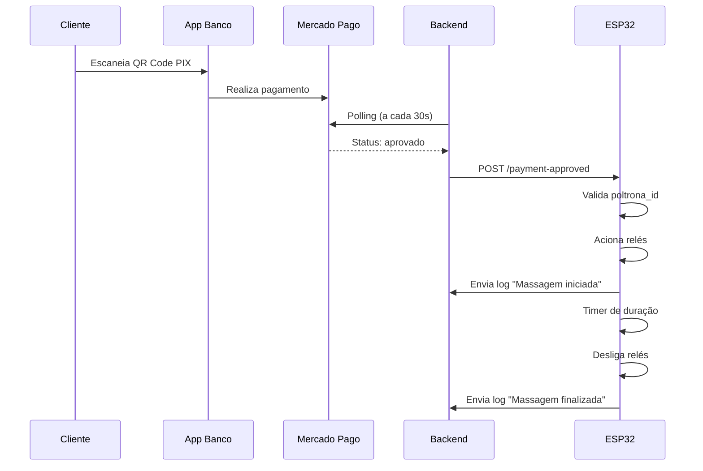

# Manual de Instalação e Configuração ESP32
## Sistema de Poltrona de Massagem

---

## 📋 Sumário

1. [Materiais Necessários](#materiais-necessários)
2. [Esquema de Ligação](#esquema-de-ligação)
3. [Instalação do Firmware](#instalação-do-firmware)
4. [Configuração Inicial](#configuração-inicial)
5. [Funcionamento do Sistema](#funcionamento-do-sistema)
6. [Troubleshooting](#troubleshooting)
7. [Códigos de Erro](#códigos-de-erro)

---

## 🛠️ Materiais Necessários

### Hardware Obrigatório
- **ESP32 DevKit** (qualquer versão com WiFi)
- **4x Módulos Relé** (5V ou 3.3V compatível)
- **Fonte de alimentação 5V/2A** (para o ESP32)
- **Fonte de alimentação adequada** (para os motores de massagem)
- **Cabos jumper** (macho-fêmea e macho-macho)
- **Protoboard** (opcional, para testes)

### Hardware Opcional
- **LED RGB** (para indicadores visuais)
- **Resistores 220Ω** (para LEDs)
- **Case/caixa** (para proteção do circuito)

### Software Necessário
- **Arduino IDE** (versão 2.0 ou superior)
- **Bibliotecas Arduino:**
  - WiFi (built-in ESP32)
  - WebServer (built-in ESP32)
  - HTTPClient (built-in ESP32)
  - ArduinoJson (instalar via Library Manager)
  - Preferences (built-in ESP32)

---

## 🔌 Esquema de Ligação

### Pinout do ESP32

```
ESP32          →    Componente
----------------------------------------
GPIO 2         →    Relé 1 (Motor 1)
GPIO 4         →    Relé 2 (Motor 2)
GPIO 5         →    Relé 3 (Motor 3)
GPIO 18        →    Relé 4 (Motor 4)
GPIO 2         →    LED Status (compartilhado)
GND            →    GND comum
5V/VIN         →    5V fonte externa
```

### Módulo Relé (4 canais)

```
Relé           ESP32        Motor
----------------------------------------
IN1      →     GPIO 2    →  Motor 1
IN2      →     GPIO 4    →  Motor 2
IN3      →     GPIO 5    →  Motor 3
IN4      →     GPIO 18   →  Motor 4
VCC      →     5V
GND      →     GND
```

### ⚠️ IMPORTANTE - Alimentação dos Motores

Os motores de massagem NÃO devem ser alimentados diretamente pelo ESP32!

```
Fonte Externa (12V/24V)  →  Relé (NO/COM)  →  Motor
                           ↑
                      ESP32 (controle)
```

- Use uma fonte externa adequada para os motores
- Os relés apenas comutam a alimentação
- ESP32 controla os relés com sinais de 3.3V

---

## 💾 Instalação do Firmware

### Passo 1: Preparar Arduino IDE

1. Instale o Arduino IDE 2.0+
2. Adicione suporte ao ESP32:
   - File → Preferences
   - Additional Board Manager URLs:
     ```
     https://raw.githubusercontent.com/espressif/arduino-esp32/gh-pages/package_esp32_index.json
     ```
   - Tools → Board → Boards Manager → Pesquise "ESP32" → Instale

3. Instale a biblioteca ArduinoJson:
   - Tools → Manage Libraries
   - Pesquise "ArduinoJson"
   - Instale versão 6.x ou superior

### Passo 2: Configurar o Código

1. Abra o arquivo `esp32_poltrona_v2.ino`
2. Conecte o ESP32 via USB
3. Selecione a placa:
   - Tools → Board → ESP32 Arduino → "ESP32 Dev Module"
4. Selecione a porta:
   - Tools → Port → Selecione a porta USB do ESP32

### Passo 3: Upload do Firmware

1. Clique em "Upload" (seta para direita)
2. Aguarde a compilação e upload
3. Abra o Serial Monitor (Ctrl+Shift+M)
4. Configure baud rate: **115200**
5. Você verá as mensagens de inicialização

---

## ⚙️ Configuração Inicial

### Primeira Inicialização

Ao ligar pela primeira vez, o ESP32 criará uma rede WiFi própria.

1. **Procure a rede WiFi:**
   - Nome: `Poltrona-Massagem-XXXXXXXX`
   - Senha: `12345678`

2. **Conecte-se à rede** com seu smartphone ou computador

3. **Acesse o portal:**
   - Abra o navegador
   - Vá para: `http://192.168.4.1`

4. **Preencha o formulário:**

   | Campo | Descrição | Exemplo |
   |-------|-----------|---------|
   | **ID da Poltrona** | Identificador único | `poltrona_1` |
   | **WiFi SSID** | Nome da sua rede WiFi | `MinhaCasa_WiFi` |
   | **WiFi Senha** | Senha da rede WiFi | `minha_senha_123` |
   | **Supabase URL** | URL do backend | `https://xxx.supabase.co` |
   | **Supabase Key** | Chave anônima | `eyJhbGciOi...` |
   | **Duração** | Tempo em segundos | `900` (15 min) |

5. **Salvar e Reiniciar**
   - Clique em "Salvar e Reiniciar"
   - ESP32 reiniciará automaticamente
   - Conectará à sua rede WiFi

6. **Verificar Conexão**
   - Abra o Serial Monitor
   - Anote o endereço IP mostrado
   - Acesse `http://{IP_DO_ESP32}` no navegador

---

## 🔄 Funcionamento do Sistema

### Fluxo de Pagamento Completo



### Endpoints HTTP do ESP32

#### GET `/`
Retorna página HTML com informações do sistema.

**Resposta:**
```html
Status: Online
IP: 192.168.1.100
Firmware: 2.0.0
Uptime: 3600s
```

#### GET `/status`
Retorna status em formato JSON.

**Resposta:**
```json
{
  "poltrona_id": "poltrona_1",
  "ip": "192.168.1.100",
  "rssi": -65,
  "firmware_version": "2.0.0",
  "uptime_seconds": 3600,
  "massage_active": false,
  "online": true
}
```

#### POST `/payment-approved`
Recebe notificação de pagamento aprovado.

**Request:**
```json
{
  "poltrona_id": "poltrona_1",
  "payment_id": 129457217899,
  "timestamp": "2025-10-15T17:00:00Z"
}
```

**Resposta Sucesso:**
```json
{
  "status": "success",
  "massage_started": true
}
```

**Resposta Erro:**
```json
{
  "error": "Wrong poltrona_id"
}
```

#### POST `/test`
Testa os relés por 10 segundos.

**Resposta:**
```json
{
  "status": "test_completed"
}
```

### Sistema de Heartbeat

O ESP32 envia atualizações automáticas a cada 60 segundos:

```
ESP32 → Backend
PATCH /rest/v1/poltrona_status
{
  "poltrona_id": "poltrona_1",
  "is_online": true,
  "last_ping": "2025-10-15T17:00:00Z",
  "firmware_version": "2.0.0",
  "wifi_signal": -65,
  "uptime_seconds": 3600
}
```

### LED de Status

| Padrão | Significado |
|--------|-------------|
| Piscando lento (1s) | Conectando ao WiFi |
| Aceso fixo | WiFi conectado |
| Piscando rápido | Erro de conexão |
| 3 piscadas rápidas | Pagamento recebido |

---

## 🔧 Troubleshooting

### ESP32 não conecta ao WiFi

**Sintomas:**
- LED piscando constantemente
- No Serial: "✗ Falha ao conectar WiFi"

**Soluções:**
1. Verifique SSID e senha no portal de configuração
2. Certifique-se de estar na faixa de alcance do WiFi
3. Verifique se o WiFi é 2.4GHz (ESP32 não suporta 5GHz)
4. Reinicie o roteador
5. Acesse `192.168.4.1` novamente e reconfigure

### ESP32 não recebe notificações

**Sintomas:**
- Pagamento aprovado mas massagem não inicia
- No Serial: Nenhuma mensagem de "Notificação recebida"

**Soluções:**
1. Verifique se o IP está correto na tabela `poltronas`
2. Confirme que ESP32 está na mesma rede
3. Teste manualmente:
   ```bash
   curl -X POST http://{IP_DO_ESP32}/test
   ```
4. Verifique logs no backend
5. Certifique-se de que polling está ativo

### Relés não acionam

**Sintomas:**
- ESP32 recebe notificação
- No Serial: "Relés ativados"
- Mas motores não ligam

**Soluções:**
1. Verifique alimentação dos módulos relé (5V)
2. Confirme conexões dos pinos GPIO
3. Teste relés individualmente:
   ```cpp
   digitalWrite(RELE_1, HIGH);
   delay(2000);
   digitalWrite(RELE_1, LOW);
   ```
4. Verifique se relé é ativo em HIGH ou LOW
5. Meça continuidade com multímetro

### Massagem não para automaticamente

**Sintomas:**
- Massagem continua após o tempo configurado
- Timer não funciona

**Soluções:**
1. Verifique campo `duration` na configuração
2. Reinicie o ESP32
3. Verifique no Serial Monitor se o timer está rodando
4. Pare manualmente:
   ```cpp
   stopMassage();
   ```

### Heartbeat não atualiza

**Sintomas:**
- Dashboard mostra "Offline"
- `last_ping` desatualizado

**Soluções:**
1. Verifique URL e Key do Supabase
2. Confirme conectividade de rede
3. Teste requisição manual:
   ```bash
   curl http://{IP_DO_ESP32}/status
   ```
4. Verifique firewall/bloqueios de rede
5. Reinicie ESP32

---

## ⚠️ Códigos de Erro

### Serial Monitor

| Mensagem | Significado | Solução |
|----------|-------------|---------|
| `✗ Falha ao conectar WiFi` | WiFi não conecta | Verificar SSID/senha |
| `✗ Erro ao enviar heartbeat: 401` | Supabase Key inválida | Verificar configuração |
| `✗ Erro ao enviar heartbeat: 404` | URL incorreta | Verificar Supabase URL |
| `✗ Erro ao enviar log: XXX` | Problema na API | Verificar conexão |
| `Poltrona ID não corresponde` | Notificação para outra poltrona | Verificar `poltrona_id` |

### HTTP Status Codes

| Código | Significado |
|--------|-------------|
| 200 | Sucesso |
| 400 | Requisição inválida (JSON mal formado) |
| 401 | Não autorizado (chave inválida) |
| 404 | Recurso não encontrado |
| 500 | Erro interno do servidor |
| 503 | Serviço indisponível |

---

## 📊 Monitoramento

### Via Serial Monitor

Conecte via USB e monitore em tempo real:
```
=================================
Sistema de Poltrona de Massagem
Versão: 2.0.0
=================================

✓ Pinos configurados
✓ Configuração carregada:
  Poltrona ID: poltrona_1
  WiFi SSID: MinhaCasa_WiFi
  Duração: 900s
Conectando ao WiFi: MinhaCasa_WiFi
......
✓ WiFi conectado!
  IP: 192.168.1.100
  RSSI: -65 dBm
✓ Servidor web iniciado
  Endpoints disponíveis:
    GET  /         - Página inicial
    GET  /status   - Status do sistema
    POST /payment-approved - Receber notificação de pagamento
    POST /test     - Teste de relés
✓ Heartbeat enviado
```

### Via Dashboard Web

1. Acesse a página "Config ESP32" no sistema
2. Veja status em tempo real:
   - Online/Offline
   - IP e sinal WiFi
   - Firmware version
   - Uptime
   - Último ping
3. Execute testes remotos

### Via HTTP Requests

```bash
# Status geral
curl http://192.168.1.100/status

# Testar relés
curl -X POST http://192.168.1.100/test

# Simular pagamento
curl -X POST http://192.168.1.100/payment-approved \
  -H "Content-Type: application/json" \
  -d '{
    "poltrona_id": "poltrona_1",
    "payment_id": 123456789,
    "timestamp": "2025-10-15T17:00:00Z"
  }'
```

---

## 🔒 Segurança

### Recomendações

1. **Rede WiFi:**
   - Use WPA2/WPA3
   - Senha forte
   - Segmente a rede (VLAN para IoT)

2. **Atualizações:**
   - Mantenha firmware atualizado
   - Monitore logs de segurança

3. **Física:**
   - Proteja o ESP32 em case fechado
   - Use fonte de alimentação adequada
   - Evite exposição à umidade

4. **Acesso:**
   - Limite acesso físico
   - Monitore logs de atividade
   - Configure alertas para offline

---

## 📞 Suporte

Em caso de dúvidas ou problemas:

1. Consulte os logs no Serial Monitor
2. Verifique a seção de Troubleshooting
3. Acesse a documentação online
4. Entre em contato com o suporte técnico

---

**Versão do Manual:** 2.0  
**Data:** Outubro 2025  
**Compatibilidade:** ESP32 Firmware v2.0.0+
