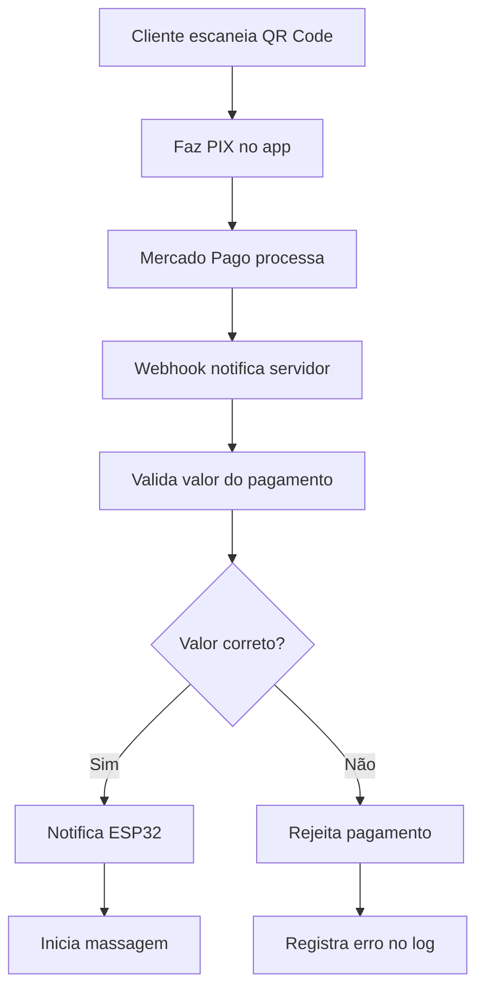

# Integração Mercado Pago - Sistema de Poltronas

Este documento explica como configurar e usar a integração com Mercado Pago para pagamentos PIX via QR Code fixo.

## 🚀 Visão Geral

O sistema agora suporta pagamentos PIX através do Mercado Pago com as seguintes funcionalidades:

- **QR Code Fixo**: Gera um QR code único para cada poltrona com valor determinado
- **Validação de Valor**: Rejeita pagamentos com valores diferentes do configurado
- **Webhook em Tempo Real**: Notifica o ESP32 instantaneamente quando o pagamento é aprovado
- **Fallback**: Sistema de verificação periódica como backup

## 🔧 Configuração

### 1. Configurar Mercado Pago

#### Obter Credenciais
1. Acesse [Mercado Pago Developers](https://www.mercadopago.com.br/developers)
2. Crie uma aplicação
3. Obtenha seu **Access Token** (produção ou sandbox)

#### Configurar Webhook
1. No dashboard do Mercado Pago, vá em **Desenvolvimento** > **Webhooks**
2. Adicione a URL: `https://seu-dominio.com/api/webhook/mercadopago`
3. Selecione os eventos: **payment**
4. Configure autenticação com seu access token

### 2. Configurar Variáveis de Ambiente

```bash
# Supabase
SUPABASE_URL=https://seu-projeto.supabase.co
SUPABASE_ANON_KEY=sua-chave-anonima

# Mercado Pago
MERCADOPAGO_ACCESS_TOKEN=seu-access-token
```

### 3. Deploy do Webhook

#### Opção A: Vercel
```bash
# Instalar Vercel CLI
npm i -g vercel

# Deploy
vercel --prod
```

#### Opção B: Netlify
```bash
# Instalar Netlify CLI
npm i -g netlify-cli

# Deploy
netlify deploy --prod
```

#### Opção C: Express.js
```bash
# Instalar dependências
npm install express @supabase/supabase-js

# Executar
node api_webhook_example.js
```

## 📱 Como Funciona

### Fluxo de Pagamento



### 1. Geração do QR Code

Quando o ESP32 inicia:
1. Conecta ao WiFi e Supabase
2. Gera um pagamento PIX via API do Mercado Pago
3. Obtém o QR code correspondente
4. Armazena no Supabase para exibição

### 2. Processamento do Pagamento

Quando o cliente paga:
1. Mercado Pago processa o PIX
2. Envia webhook para seu servidor
3. Servidor valida o valor (deve ser exato)
4. Se válido, notifica o ESP32
5. ESP32 inicia a massagem

### 3. Validação de Valor

O sistema rejeita pagamentos que não sejam exatamente o valor configurado:
- **Tolerância**: 1 centavo
- **Valor esperado**: Configurado na poltrona
- **Valor recebido**: Do pagamento PIX

## 🔧 Configuração do ESP32

### 1. Upload do Código

1. Abra `esp32_massage_chair.ino` no Arduino IDE
2. Configure as constantes:
   ```cpp
   #define SUPABASE_URL "https://seu-projeto.supabase.co"
   #define SUPABASE_ANON_KEY "sua-chave-anonima"
   #define MERCADOPAGO_ACCESS_TOKEN "seu-access-token"
   ```
3. Faça upload para o ESP32

### 2. Configuração via Web

1. Conecte-se à rede WiFi do ESP32
2. Acesse `http://192.168.4.1`
3. Configure:
   - **WiFi**: Credenciais da sua rede
   - **Supabase**: URL e chave
   - **Mercado Pago**: Access token
   - **Poltrona**: ID, preço, localização

### 3. Verificar Funcionamento

1. Acesse `http://{ip-do-esp32}/status`
2. Verifique se:
   - ✅ WiFi conectado
   - ✅ Supabase conectado
   - ✅ QR Code PIX gerado
   - ✅ Payment ID exibido

## 📊 Monitoramento

### Logs do Sistema

```sql
-- Ver logs recentes
SELECT * FROM logs 
WHERE poltrona_id = 'p1' 
ORDER BY created_at DESC 
LIMIT 10;

-- Ver pagamentos aprovados
SELECT * FROM payments 
WHERE poltrona_id = 'p1' 
AND status = 'approved' 
ORDER BY approved_at DESC;
```

### Status via API

```bash
# Status do ESP32
curl http://{ip-do-esp32}:8080/api/status

# Resposta:
{
  "poltrona_id": "p1",
  "wifi_connected": true,
  "supabase_connected": true,
  "qr_generated": true,
  "massage_active": false,
  "payment_id": "1234567890",
  "price": 10.00
}
```

## 🐛 Troubleshooting

### QR Code não gera

**Possíveis causas:**
- Token do Mercado Pago inválido
- Sem conexão com internet
- Erro na API do Mercado Pago

**Solução:**
1. Verifique o token no dashboard do Mercado Pago
2. Teste a conexão WiFi
3. Verifique os logs do ESP32

### Pagamento não libera massagem

**Possíveis causas:**
- Webhook não configurado
- Valor do pagamento incorreto
- ESP32 não recebeu notificação

**Solução:**
1. Verifique se o webhook está funcionando
2. Confirme o valor exato do pagamento
3. Teste a notificação manualmente

### Valor rejeitado

**Possíveis causas:**
- Cliente pagou valor diferente
- Configuração de preço incorreta
- Problema de precisão decimal

**Solução:**
1. Verifique o preço configurado na poltrona
2. Confirme que o cliente pagou o valor exato
3. Verifique os logs de validação

## 🔒 Segurança

### Validações Implementadas

1. **Autenticação do Webhook**: Token obrigatório
2. **Validação de Valor**: Tolerância de 1 centavo
3. **Verificação de Poltrona**: ID deve existir e estar ativa
4. **Logs de Auditoria**: Todos os eventos registrados

### Recomendações

1. **Use HTTPS**: Para webhooks em produção
2. **Monitore Logs**: Verifique tentativas de fraude
3. **Backup de Configurações**: Mantenha cópias das configurações
4. **Teste Regularmente**: Valide o funcionamento periodicamente

## 📈 Próximas Melhorias

- [ ] Suporte a múltiplos valores por poltrona
- [ ] Interface para reconfigurar QR codes
- [ ] Relatórios de pagamentos em tempo real
- [ ] Notificações push para administradores
- [ ] Sistema de backup automático
- [ ] Integração com outros gateways de pagamento

## 📞 Suporte

### Logs Importantes

```bash
# Logs do ESP32 (Serial Monitor)
[INFO] QR Code gerado com sucesso - Payment ID: 1234567890
[INFO] Pagamento aprovado via webhook - ID: 1234567890
[ERROR] Valor do pagamento inválido - Esperado: 10.00, Recebido: 9.50
```

### Testes

```bash
# Testar webhook manualmente
curl -X POST https://seu-dominio.com/api/webhook/mercadopago \
  -H "Authorization: Bearer seu-token" \
  -H "Content-Type: application/json" \
  -d '{"type":"payment","data":{"id":"1234567890"}}'

# Testar notificação ESP32
curl -X POST http://{ip-esp32}:8080/api/payment-approved \
  -H "Content-Type: application/json" \
  -d '{"paymentId":"1234567890","poltronaId":"p1"}'
```

---

**Sistema Integrado Mercado Pago + ESP32 + Supabase**  
*Pagamentos PIX seguros e confiáveis para poltronas de massagem*
